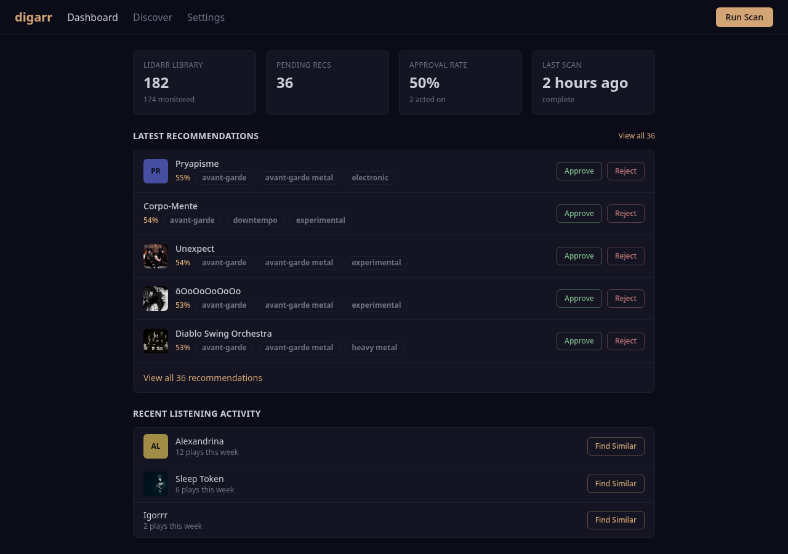

# Digarr

[](https://github.com/iuliandita/digarr/actions/workflows/ci.yml)
[](LICENSE)
[](https://bun.sh)
[](https://www.typescriptlang.org)
[](deploy/docker/)
[]()
[](https://github.com/iuliandita/digarr/releases)

**Discover new music for your Lidarr library.** Digarr analyzes your listening history from ListenBrainz or Last.fm, finds similar artists using MusicBrainz and AI, scores and ranks them, and lets you approve recommendations that get added straight to Lidarr.

Think of it as Jellyseerr/Overseerr, but for music discovery.




---

## Features

- **Listening history analysis** -- connects to ListenBrainz and/or Last.fm to understand your taste
- **Multi-source discovery** -- finds similar artists via Last.fm, MusicBrainz, and your existing Lidarr library
- **AI-powered recommendations** -- uses Anthropic (Claude), OpenAI, or Ollama to generate personalized suggestions with written explanations
- **Smart scoring** -- weighted composite scoring across consensus, similarity, genre overlap, AI confidence, and feedback learning
- **One-click Lidarr integration** -- approve a recommendation and it gets added to Lidarr with your preferred quality/metadata profiles
- **Artist enrichment** -- artist images (via fanart.tv/Lidarr), streaming links (Spotify, YouTube, Deezer), MusicBrainz metadata
- **Quick discover** -- click "Find Similar" on any recent listen to get targeted recommendations
- **Configurable pipeline** -- score thresholds, scoring weights, library seed ratio, rejection cooldowns, cron scheduling
- **Setup wizard** -- guided 4-step setup with connection testing
- **Dark UI** -- clean, responsive interface with keyboard shortcuts (j/k navigate, a approve, r reject)
- **Self-hosted** -- runs as a single container alongside your existing *arr stack

---

## Quick Start

### Docker Compose (recommended)

```sh
git clone https://github.com/iuliandita/digarr.git
cd digarr/deploy/docker
cp .env.example .env
docker compose up -d
```

Open `http://localhost:3000` and complete the setup wizard. Alternatively, fill in the service env vars in `.env` and setup completes automatically on first boot.

### Local Development

```sh
git clone https://github.com/iuliandita/digarr.git
cd digarr
./scripts/dev-setup.sh    # starts postgres, installs deps, runs migrations

# Start in two terminals:
bun run dev                # API server on :3000
bun run dev:web            # Vite dev server on :5173
```

Open `http://localhost:5173`.

---

## How It Works

Digarr runs a recommendation pipeline with 7 stages:

1. **Collect** -- fetches your current Lidarr library
2. **Analyze** -- builds a taste profile from your ListenBrainz/Last.fm listening data
3. **Discover** -- queries multiple sources for similar artists (Last.fm similar artists, AI recommendations, library-seeded discovery)
4. **Resolve** -- validates each candidate against MusicBrainz, fetches metadata, streaming URLs, and artist images
5. **Score** -- applies a weighted composite formula (consensus, similarity, genre overlap, AI confidence, feedback boost)
6. **Filter** -- removes artists already in your library, previously rejected artists (with cooldown), and below-threshold scores
7. **Store** -- persists the batch and recommendations to the database

The pipeline runs on a configurable cron schedule or manually via the "Run Scan" button.

---

## Requirements

| Service | Required | Purpose |
|---------|----------|---------|
| **Lidarr** | Yes | Music library management, artist addition |
| **ListenBrainz** or **Last.fm** | At least one | Listening history for taste analysis |
| **AI Provider** | Yes | Artist recommendations (Anthropic, OpenAI, or Ollama) |
| **PostgreSQL** | Yes | Data storage (included in Docker Compose) |

---

## Configuration

All configuration is done through the web UI after initial setup. Key settings:

### Connections (Settings > Connections)
- Lidarr URL, API key, quality/metadata profiles, root folder
- ListenBrainz username + token
- Last.fm username + API key
- AI provider, model, API key

### Recommendations (Settings > Recommendations)
- **Score threshold** -- minimum score to show a recommendation (0-1)
- **Scoring weights** -- how much each factor contributes (must sum to 1.0)
- **Library seed ratio** -- fraction of discovery seeds from your existing library vs listening history
- **Rejection cooldown** -- days before a rejected artist can be recommended again
- **Top artists limit** -- how many of your top artists to use as seeds

### Schedule (Settings > Schedule)
- Preset schedules: daily, weekly, biweekly, monthly
- Custom cron expression
- Manual "Run Now" trigger

---

## Deployment

| Method | Path | Notes |
|--------|------|-------|
| Docker Compose | [`deploy/docker/`](deploy/docker/) | Recommended. Includes PostgreSQL. |
| Helm chart | [`deploy/helm/digarr/`](deploy/helm/digarr/) | Kubernetes. Includes Bitnami PostgreSQL subchart. |
| Raw k8s manifests | [`deploy/k8s/`](deploy/k8s/) | Reference manifests for advanced setups. |

### Environment Variables

All service config can be set via env vars. These act as **fallbacks** -- values set through the web UI (stored in the database) always take precedence. If all required vars are set, setup completes automatically on first boot.

See [`.env.example`](.env.example) for the full list with comments.

| Variable | Default | Description |
|----------|---------|-------------|
| `DATABASE_URL` | -- | PostgreSQL connection string (or use `DB_*` vars below) |
| `DB_HOST` | -- | PostgreSQL host (alternative to `DATABASE_URL`) |
| `DB_PORT` | `5432` | PostgreSQL port |
| `DB_USER` | -- | PostgreSQL user |
| `DB_PASS` | -- | PostgreSQL password |
| `DB_NAME` | -- | PostgreSQL database name |
| `PORT` | `3000` | Server port |
| `ALLOWED_ORIGIN` | -- | CORS origin (empty = same-origin in prod, `*` in dev) |
| `LIDARR_URL` | -- | Lidarr server URL |
| `LIDARR_API_KEY` | -- | Lidarr API key |
| `SKIP_TLS_VERIFY` | `false` | Skip TLS certificate verification |
| `LISTENBRAINZ_USERNAME` | -- | ListenBrainz username |
| `LISTENBRAINZ_TOKEN` | -- | ListenBrainz API token |
| `LASTFM_USERNAME` | -- | Last.fm username |
| `LASTFM_API_KEY` | -- | Last.fm API key |
| `AI_PROVIDER` | -- | AI provider (`openai`, `anthropic`, or `ollama`) |
| `AI_MODEL` | -- | AI model name |
| `AI_API_KEY` | -- | AI provider API key |
| `AI_BASE_URL` | -- | Custom API base URL (for Ollama or compatible APIs) |

---

## Tech Stack

- **Runtime**: [Bun](https://bun.sh)
- **Backend**: [Hono](https://hono.dev) (API server)
- **Frontend**: React 19, [Tailwind CSS](https://tailwindcss.com) v4, [shadcn/ui](https://ui.shadcn.com)
- **Database**: PostgreSQL via [Drizzle ORM](https://orm.drizzle.team)
- **Build**: [Vite](https://vite.dev)
- **Lint/Format**: [Biome](https://biomejs.dev)
- **Tests**: [Vitest](https://vitest.dev) (267 tests)

---

## Contributing

See [CONTRIBUTING.md](CONTRIBUTING.md) for development setup, code style, and PR guidelines.

```sh
bun install
bun run lint        # biome check
bun run typecheck   # tsc --noEmit
bun run test        # vitest (267 tests)
```

---

## How This Was Built

This project was built with the help of agentic AI coding tools. The design, architecture decisions, feature priorities, and quality standards were driven by a human; the implementation was a collaborative effort between human direction and AI code generation. We believe in transparency about how software is made.

### Quality assurance

The codebase went through multiple rounds of verification before release:

- **261 unit and integration tests** across 27 test files -- API clients, pipeline stages, server routes, database queries, and UI components
- **Static analysis** -- zero errors from TypeScript strict mode (`noUncheckedIndexedAccess`, `isolatedModules`) and Biome linter across 96 source files
- **Security audit** -- identified and fixed critical vulnerabilities:
  - CORS restricted to configured origin (no wildcard in production)
  - Settings PATCH endpoint allowlisted to prevent arbitrary field injection
  - Setup endpoint locked after completion to prevent re-registration attacks
  - URL validation on connection test endpoints to prevent SSRF
  - Streaming link URLs sanitized at render time to prevent XSS
  - SSE stream lifecycle fixed to prevent server-side connection leaks
  - Database writes wrapped with proper status transitions (running -> completed)
  - Artist upsert uses COALESCE to prevent null values from clobbering existing data
- **Code review** -- two full reviews covering bugs, type safety, performance, and API design. Key fixes:
  - Rejection cooldown and feedback learning loop wired to actual database queries (were previously disconnected)
  - Cron scheduler connected to settings (was instantiated but never started)
  - Health check verifies database connectivity (returns 503 on failure)
  - Default values synchronized across schema, backend, and frontend
- **Dependency audit** -- frontend-only packages moved to devDependencies, production Docker image slimmed from 564 MB to 213 MB, container runs as non-root user
- **End-to-end testing** -- deployed and tested against a real Lidarr instance, ListenBrainz account, and AI provider across multiple iterations

If you find issues, please [open an issue](https://github.com/iuliandita/digarr/issues).

---

## License

MIT -- see [LICENSE](LICENSE).
