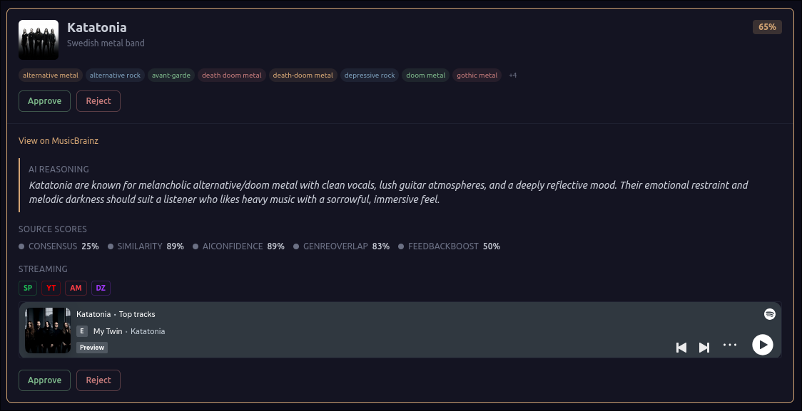
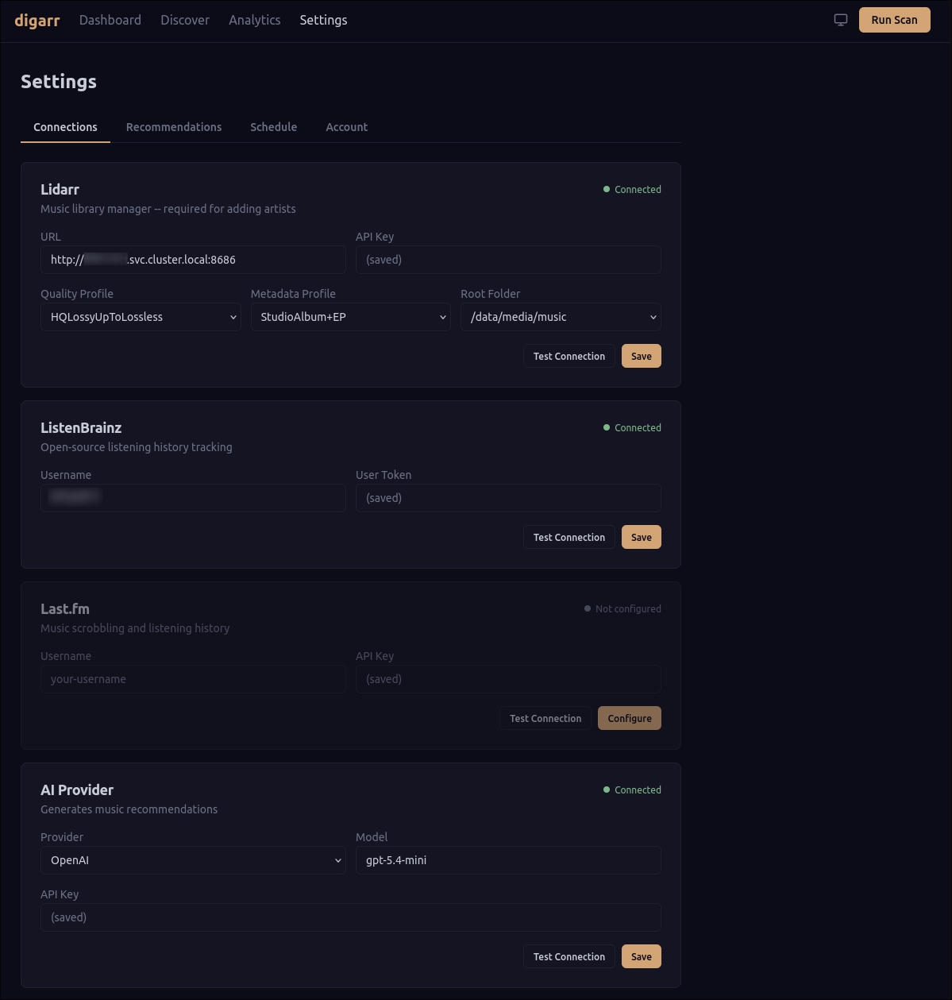
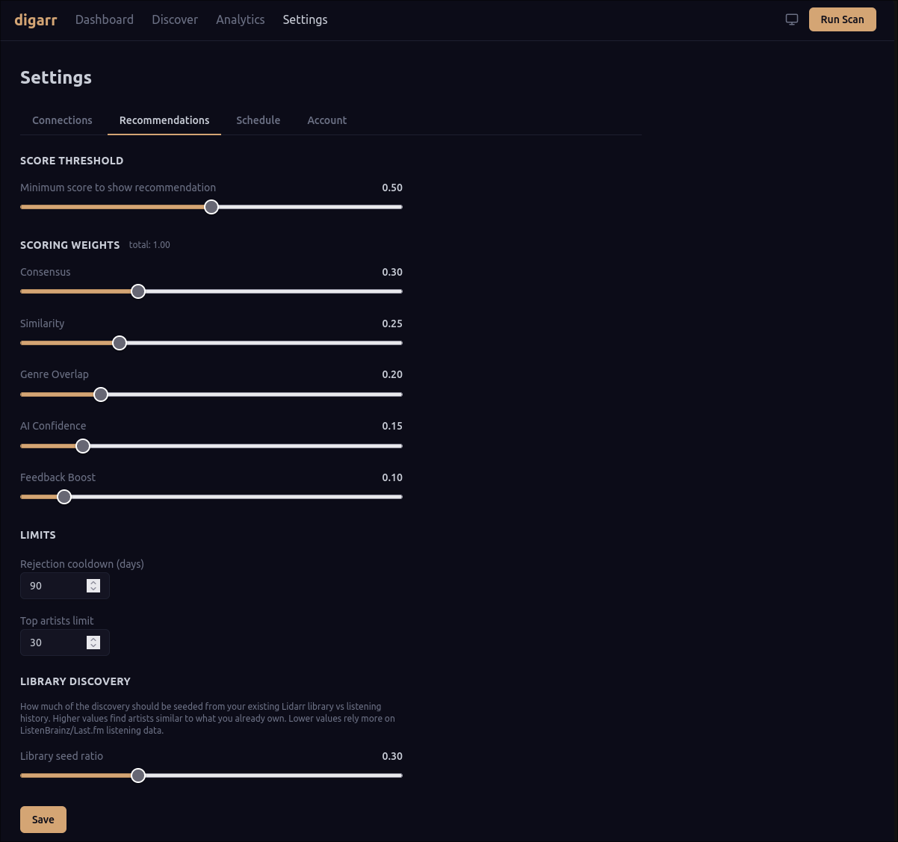
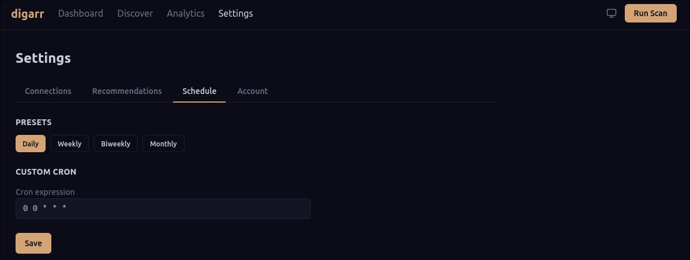
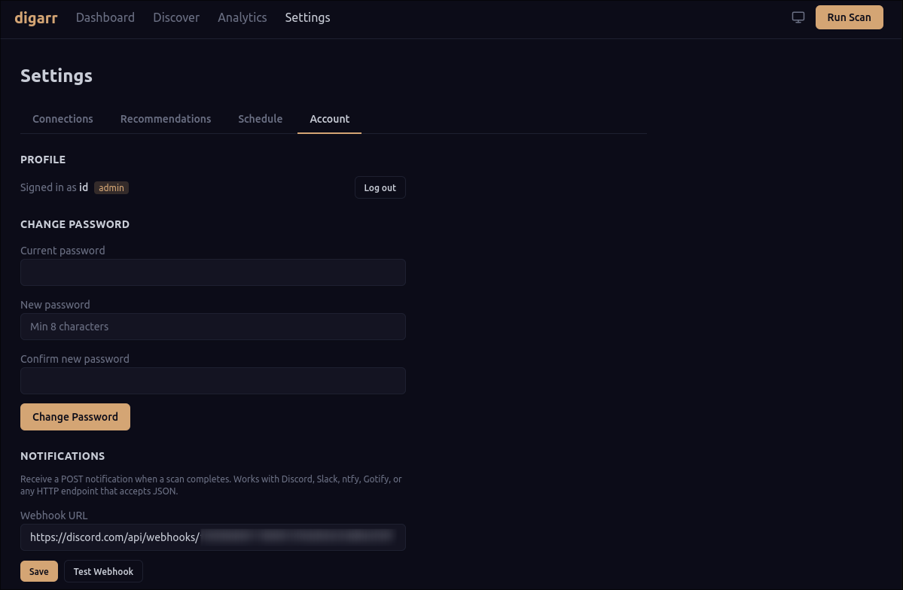

# Digarr

[](https://github.com/iuliandita/digarr/actions/workflows/ci.yml)
[](LICENSE)
[](https://bun.sh)
[](https://www.typescriptlang.org)
[](deploy/docker/)
[]()
[](https://github.com/iuliandita/digarr/releases)

**Discover new music for your Lidarr library.** Digarr analyzes your listening history from ListenBrainz or Last.fm, finds similar artists using MusicBrainz and AI, scores and ranks them, and lets you approve recommendations that get added straight to Lidarr.

Think of it as Jellyseerr/Overseerr, but for music discovery.













---

## Features

- **Listening history analysis** -- connects to ListenBrainz and/or Last.fm to understand your taste
- **Pluggable sources** -- DiscoverySource interface with declared capabilities (genreArtists, topArtists, similarArtists, etc.); ListenBrainz and Last.fm built-in, extensible
- **AI-powered recommendations** -- uses Anthropic (Claude), OpenAI, or Ollama to generate personalized suggestions with written explanations
- **Smart scoring** -- weighted composite scoring across consensus, similarity, genre overlap (from Lidarr library tags), AI confidence, and feedback learning
- **One-click Lidarr integration** -- approve a recommendation and it gets added to Lidarr with your preferred quality/metadata profiles. Lidarr is optional -- the pipeline runs without it using listening sources and genre subscriptions
- **Artist enrichment** -- artist images (via fanart.tv/Lidarr), streaming links (Spotify, YouTube, Deezer), MusicBrainz metadata
- **Music previews** -- play Spotify embeds or YouTube previews directly from recommendation cards
- **SkyHook cache warming** -- pre-warms MusicBrainz/fanart.tv metadata before Lidarr adds to prevent 503 errors
- **Quick discover** -- click "Find Similar" on any recent listen to get targeted recommendations
- **Genre discovery** -- browse genres from your library, search the full genre catalog, view genre detail pages with sub-genres and library overlap
- **Genre subscriptions** -- subscribe to genres for automatic discovery on independent cron schedules
- **Library health dashboard** -- 7 automated health checks (missing metadata, stale MBIDs, unmonitored artists, missing albums, duplicates, genre gaps, image gaps) with one-click batch fixes
- **Configurable pipeline** -- score thresholds, scoring weights, library seed ratio, rejection cooldowns, cron scheduling with hot-reload
- **Setup wizard** -- guided 4-step setup with connection testing
- **Dark/light/system themes** -- clean, responsive interface with keyboard shortcuts (j/k navigate, a approve, r reject, d detail, ? help overlay), paginated discover view
- **Swipe-to-approve** -- swipe right to approve, left to reject on mobile; desktop gets hover action buttons
- **Card stack view** -- Tinder-style one-card-at-a-time discovery mode for mobile
- **Bulk actions** -- select multiple recommendations, approve or reject in batch
- **Mobile PWA** -- installable on phones, responsive nav
- **Multi-user** -- per-user recommendation queues, session-based auth with username/password, admin role
- **Optional auth** -- bearer token (`DIGARR_AUTH_TOKEN`) or per-user login
- **Analytics dashboard** -- track approval rates, genre trends, source effectiveness, and batch history over time
- **Webhook notifications** -- get notified when scans complete (Discord, Slack, ntfy, Gotify, or any HTTP endpoint)
- **Request logging** -- HTTP request logging with method/path/status/duration for production debugging
- **Self-hosted** -- runs as a single container alongside your existing *arr stack

---

## Quick Start

### Docker Compose (recommended)

```sh
git clone https://github.com/iuliandita/digarr.git
cd digarr/deploy/docker
cp .env.example .env
docker compose up -d
```

Open `http://localhost:3000` and complete the setup wizard. Alternatively, fill in the service env vars in `.env` and setup completes automatically on first boot. Database migrations run automatically on every startup.

### Local Development

```sh
git clone https://github.com/iuliandita/digarr.git
cd digarr
./scripts/dev-setup.sh    # starts postgres, installs deps, runs migrations

# Start in two terminals:
bun run dev                # API server on :3000
bun run dev:web            # Vite dev server on :5173
```

Open `http://localhost:5173`.

---

## How It Works

Digarr runs a recommendation pipeline with 7 stages:

1. **Collect** -- fetches your current Lidarr library
2. **Analyze** -- builds a taste profile from your ListenBrainz/Last.fm listening data
3. **Discover** -- queries multiple sources for similar artists (Last.fm similar artists, AI recommendations, library-seeded discovery)
4. **Resolve** -- validates each candidate against MusicBrainz, fetches metadata, streaming URLs, and artist images
5. **Score** -- applies a weighted composite formula (consensus, similarity, genre overlap, AI confidence, feedback boost)
6. **Filter** -- removes artists already in your library, previously rejected artists (with cooldown), and below-threshold scores
7. **Store** -- persists the batch and recommendations to the database

The pipeline runs on a configurable cron schedule or manually via the "Run Scan" button.

---

## Requirements

| Service | Required | Purpose |
|---------|----------|---------|
| **Lidarr** | Recommended | Music library management. Pipeline works without it using listening sources only |
| **ListenBrainz** or **Last.fm** | At least one | Listening history for taste analysis |
| **AI Provider** | Yes | Artist recommendations (Anthropic, OpenAI, or Ollama) |
| **PostgreSQL** | Yes | Data storage (included in Docker Compose) |

---

## Configuration

All configuration is done through the web UI after initial setup. Key settings:

### Connections (Settings > Connections)
- Lidarr URL, API key, quality/metadata profiles, root folder
- ListenBrainz username + token
- Last.fm username + API key
- AI provider, model, API key

### Recommendations (Settings > Recommendations)
- **Score threshold** -- minimum score to show a recommendation (0-1)
- **Scoring weights** -- how much each factor contributes (must sum to 1.0)
- **Library seed ratio** -- fraction of discovery seeds from your existing library vs listening history
- **Rejection cooldown** -- days before a rejected artist can be recommended again
- **Top artists limit** -- how many of your top artists to use as seeds

### Schedule (Settings > Schedule)
- Preset schedules: daily, weekly, biweekly, monthly
- Custom cron expression
- Manual "Run Now" trigger

---

## Deployment

| Method | Path | Notes |
|--------|------|-------|
| Docker Compose | [`deploy/docker/`](deploy/docker/) | Recommended. Includes PostgreSQL. |
| Helm chart | [`deploy/helm/digarr/`](deploy/helm/digarr/) | Kubernetes. Bundled PostgreSQL or bring your own. |
| Raw k8s manifests | [`deploy/k8s/`](deploy/k8s/) | Reference manifests for advanced setups. |

### Environment Variables

All service config can be set via env vars. These act as **fallbacks** -- values set through the web UI (stored in the database) always take precedence. If all required vars are set, setup completes automatically on first boot.

See [`.env.example`](.env.example) for the full list with comments.

| Variable | Default | Description |
|----------|---------|-------------|
| `DATABASE_URL` | -- | PostgreSQL connection string (or use `DB_*` vars below) |
| `DB_HOST` | -- | PostgreSQL host (alternative to `DATABASE_URL`) |
| `DB_PORT` | `5432` | PostgreSQL port |
| `DB_USER` | -- | PostgreSQL user |
| `DB_PASS` | -- | PostgreSQL password |
| `DB_NAME` | -- | PostgreSQL database name |
| `PORT` | `3000` | Server port |
| `ALLOWED_ORIGIN` | -- | CORS allowed origin (defaults to `*` if unset; set for production security) |
| `LIDARR_URL` | -- | Lidarr server URL |
| `LIDARR_API_KEY` | -- | Lidarr API key |
| `SKIP_TLS_VERIFY` | `false` | Skip TLS certificate verification |
| `LISTENBRAINZ_USERNAME` | -- | ListenBrainz username |
| `LISTENBRAINZ_TOKEN` | -- | ListenBrainz API token |
| `LASTFM_USERNAME` | -- | Last.fm username |
| `LASTFM_API_KEY` | -- | Last.fm API key |
| `AI_PROVIDER` | -- | AI provider (`openai`, `anthropic`, or `ollama`) |
| `AI_MODEL` | -- | AI model name |
| `AI_API_KEY` | -- | AI provider API key |
| `AI_BASE_URL` | -- | Custom API base URL (for Ollama or compatible APIs) |
| `DIGARR_AUTH_TOKEN` | -- | Bearer token for API authentication (empty = auth disabled) |
| `DIGARR_INITIAL_USERNAME` | -- | Auto-create admin user on first boot (requires password) |
| `DIGARR_INITIAL_PASSWORD` | -- | Password for auto-created admin (min 8 characters) |
| `WEBHOOK_URL` | -- | Scan completion webhook (Discord, Slack, ntfy, or any HTTP endpoint) |

---

## Tech Stack

- **Runtime**: [Bun](https://bun.sh)
- **Backend**: [Hono](https://hono.dev) (API server)
- **Frontend**: React 19, [Tailwind CSS](https://tailwindcss.com) v4, [shadcn/ui](https://ui.shadcn.com)
- **Database**: PostgreSQL via [Drizzle ORM](https://orm.drizzle.team)
- **Build**: [Vite](https://vite.dev)
- **Lint/Format**: [Biome](https://biomejs.dev)
- **Tests**: [Vitest](https://vitest.dev) (673 tests)

---

## Contributing

See [CONTRIBUTING.md](CONTRIBUTING.md) for development setup, code style, and PR guidelines.

```sh
bun install
bun run lint        # biome check
bun run typecheck   # tsc --noEmit
bun run test        # vitest (673 tests)
```

---

## How This Was Built

This project was built with the help of agentic AI coding tools. The design, architecture decisions, feature priorities, and quality standards were driven by a human; the implementation was a collaborative effort between human direction and AI code generation. We believe in transparency about how software is made.

### Quality assurance

The codebase went through multiple rounds of verification before release:

- **673 unit and integration tests** across 51 test files -- API clients, pipeline stages, server routes, database queries, auth/session logic, and UI components (including RecommendationCard, PipelineProgress, Settings, Dashboard)
- **Static analysis** -- zero errors from TypeScript strict mode (`noUncheckedIndexedAccess`, `isolatedModules`) and Biome linter across 175 checked files
- **Security audit** -- identified and fixed vulnerabilities across multiple review cycles:
  - CORS defaults to allow-all when `ALLOWED_ORIGIN` unset, with startup warning in production; operators set `ALLOWED_ORIGIN` for restrictive CORS
  - Settings PATCH endpoint allowlisted to prevent arbitrary field injection
  - Setup endpoint locked after completion to prevent re-registration attacks
  - URL validation on connection test endpoints to prevent SSRF
  - Streaming link URLs sanitized at render time to prevent XSS
  - SSE stream lifecycle fixed to prevent server-side connection leaks
  - Timing-safe token comparison in auth middleware to prevent timing attacks
  - Webhook SSRF protection: private IP blocklist (RFC1918, link-local, cloud metadata 169.254.x.x), protocol validation, 10s timeout, credential scrubbing in logs
  - Password hashing via scrypt with random salt and timing-safe verification
  - Pagination offset/limit clamped to prevent negative or NaN values reaching the database
  - Auth guard scoped to `/api/*` paths only -- static assets and SPA routes always public
  - Password change verifies current password, returns 403 for legacy-token users, invalidates all other sessions
  - Bootstrap admin user from env vars enforces 8-character password minimum
  - Helm and Docker Compose require explicit database password -- no defaults
  - Helm security contexts: `runAsNonRoot`, `allowPrivilegeEscalation: false` on both app and database pods
  - Frontend 401 handler dispatches event instead of hard-reloading (was causing infinite loops)
  - Request logging middleware logs method, path, status, and duration for all requests (health check excluded)
  - SkyHook warmer status map evicts entries at 5000 to prevent unbounded memory growth
  - Warm endpoint validates MBID input types, filtering non-strings before processing
  - Lidarr API responses stripped to declared types only, preventing 50-100MB JSON payloads from persisting in memory
- **Code reviews** -- eight full reviews (after v0.1.x, v0.2.x, v0.3.x, and v0.4.x/v0.5.x milestones, plus per-feature spec compliance, quality checks, and a deployment audit). Notable finds and fixes:
  - Batch stats were hardcoded to zeros -- store() now tracks real discovered/added/failed counts
  - Genre overlap scoring (20% of recommendation score) was permanently zero -- wired Lidarr genre extraction through the pipeline
  - Cron schedule hot-reload was broken -- saving a new cron now restarts the scheduler immediately, with validation for empty/invalid expressions
  - Auth middleware setupGuard exemption for `/api/auth/status` was working by accident -- fixed to be explicit
  - `safeCompare` buffer length check corrected to use byte length instead of string char length
  - Quick-discover route had 100+ lines of duplicated pipeline logic with dynamic imports -- simplified to static imports and shared functions
  - Dead code cleanup removed 6 unused functions across 4 files
  - serveStatic resolved paths relative to module directory instead of cwd -- fixed with `path.resolve`
  - Bun bundler inlined `process.env.NODE_ENV` at build time, dead-code-eliminating the entire SPA serving block -- fixed by setting `NODE_ENV=production` in the Docker build stage
  - Pipeline preferences merge used `??` which only caught fully-null objects -- partial preferences left `rejectionCooldownDays` undefined, causing `Invalid Date` in Drizzle's pg driver
  - Quick-discover bypassed rejection cooldown, feedback history, and user scoping -- all three wired in
  - Test connection endpoints sent empty API keys when credentials showed as "(saved)" -- now fall back to stored DB credentials
  - Pipeline was OOM-killing at 1Gi in Kubernetes -- Lidarr response field stripping, block-scoped stage variables, and per-artist album fetching reduced peak memory by ~10x
  - CORS middleware silently dropped Access-Control-Allow-Origin headers when ALLOWED_ORIGIN was unset, causing login failures behind reverse proxies with zero error feedback
  - ArtistThumb component was copy-pasted across 5+ files -- extracted to a shared component
  - SkyHook warmer had unbounded memory growth -- added max-size eviction
  - Genre subscription runner used default scoring weights instead of genre-optimized preset -- wired weight presets with override support
- **Dependency audit** -- frontend-only packages moved to devDependencies, production Docker image slimmed from 564 MB to 213 MB, container runs as non-root user. Bitnami PostgreSQL subchart replaced with official `postgres:17-alpine` image. Only one runtime dependency added since initial release (@tanstack/react-query, as a dev dependency bundled by Vite)
- **End-to-end testing** -- deployed and tested against a real Lidarr instance, ListenBrainz account, and AI provider across multiple iterations, including Kubernetes deployment with Helm chart validation

If you find issues, please [open an issue](https://github.com/iuliandita/digarr/issues).

---

## License

MIT -- see [LICENSE](LICENSE).
