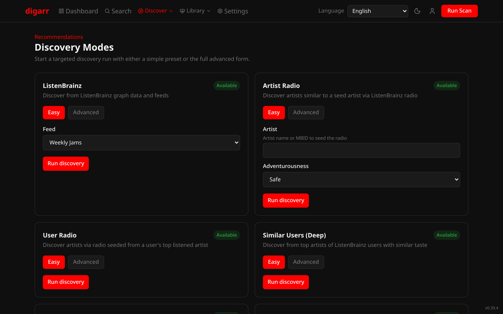
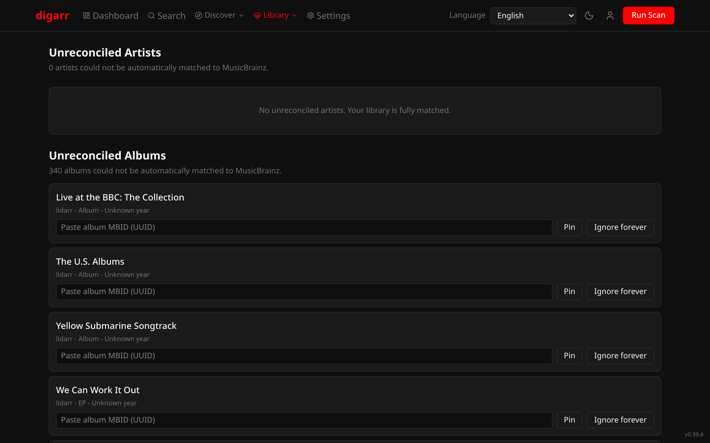
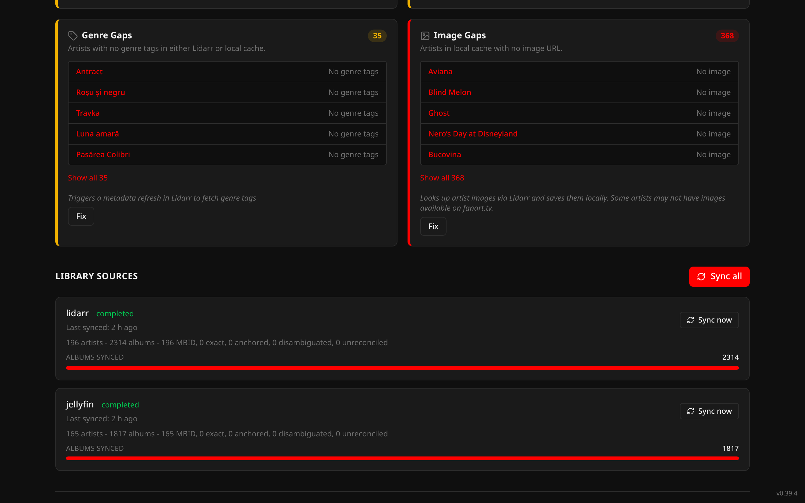

# Screenshots

All screenshots use the Youtarr theme. Capture with `bun scripts/capture-screenshots.ts` - see the header in that file for env vars.

## Dashboard (dark)

## Dashboard (light)

## Discover

## Discovery Modes

Discovery Modes lives on its own page under the Discover menu at `/discover/modes`. It includes ListenBrainz Artist Radio, User Radio, Tag Radio, Similar Users Quick/Deep, plus Release Radar and Similar Artist Web. Labels and Artist Relationships appear as unavailable placeholders until those modes ship, and each blocked card shows an explicit reason. Manual runs preflight Artist Radio seeds and record job-backed feedback instead of a blind "started" toast.

## Search

## Genres

## Genre Detail

## Playlists

## Subscriptions

## Library Health

## Library Reconciliation

Shipped in `v0.17.0`: unreconciled-artist review plus manual correct/ignore override flow. Extended in `v0.19.0` with unreconciled-album review and album override persistence.

## Library Sources Panel

Admin panel on the Library Health page. Shipped in `v0.17.0` and expanded in `v0.18.0` with per-source album sync counts and snapshot status. Polished in `v0.19.0` with album sync coverage summaries.

## Analytics

## Settings

The current Settings > Targets flow also includes `slskd` target creation with an optional linked Lidarr target for combined approvals.
